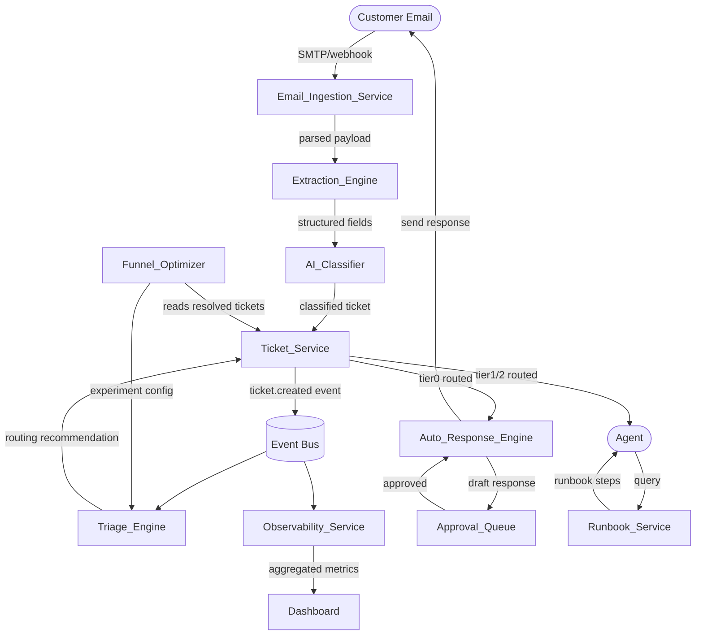

# Design Document: AI-Powered Support Operations Platform

## Overview

The AI-Powered Support Operations Platform is an event-driven, microservice-based system that transforms inbound support emails into structured tickets, routes them intelligently across resolution tiers, and progressively automates resolution through AI-generated responses and runbook-guided workflows. The platform is composed of six interconnected subsystems that share a common event bus and a central ticket store.

### Key Design Principles

- **Event-driven by default**: All state transitions emit domain events consumed by downstream services. This decouples producers from consumers and enables the observability pipeline to capture every lifecycle event without coupling to individual services.
- **Confidence-gated automation**: AI components expose a numeric confidence score alongside every classification or recommendation. Routing decisions below configured thresholds fall back to human review, preventing low-confidence automation from reaching customers.
- **Human-in-the-loop for customer-facing actions**: No response is sent to a customer without an explicit Agent approval action recorded in the Approval_Queue. This is enforced at the Auto_Response_Engine level, not as a UI convention.
- **Immutable event log**: The Observability_Service appends events but never mutates them, enabling reliable trend analysis and audit trails over the 90-day retention window.
- **Separation of read and write paths**: The Dashboard reads from a pre-aggregated metrics store updated on a scheduled cadence (≤5 minutes), keeping query latency low without burdening the transactional ticket store.

### System Context



---

## Architecture

### Architectural Style

The platform uses an **event-driven microservice architecture** with a central message broker (e.g., Apache Kafka or AWS EventBridge) as the event bus. Services communicate asynchronously via domain events for non-latency-critical paths and synchronously via REST/gRPC for latency-sensitive operations (e.g., Runbook_Service query returning within 5 seconds, Triage_Engine availability check).

### Deployment Topology

Each named service (Email_Ingestion_Service, Extraction_Engine, AI_Classifier, Ticket_Service, Triage_Engine, Auto_Response_Engine, Approval_Queue, Runbook_Service, Observability_Service, Funnel_Optimizer) is deployed as an independent, horizontally scalable unit. Services own their data stores; no service reads another service's database directly.

### Event Bus

All domain events are published to a durable, ordered event log. Consumers subscribe to topics relevant to their function. The event bus provides at-least-once delivery; services implement idempotency keys (e.g., `message_id` for email deduplication, `ticket_id` for downstream consumers) to handle redelivery safely.

**Core event topics:**

| Topic | Published by | Consumed by |
|---|---|---|
| `email.ingested` | Email_Ingestion_Service | Extraction_Engine, Observability_Service |
| `email.parse_failed` | Email_Ingestion_Service | Observability_Service (alert) |
| `ticket.created` | Ticket_Service | Triage_Engine, Observability_Service |
| `ticket.flagged_for_review` | Ticket_Service | Approval_Queue, Observability_Service |
| `ticket.routed` | Ticket_Service | Auto_Response_Engine (Tier 0), Observability_Service |
| `ticket.resolved` | Ticket_Service | Observability_Service, Funnel_Optimizer |
| `ticket.escalated` | Ticket_Service | Observability_Service |
| `triage.override` | Triage_Engine | Observability_Service |
| `response.draft_generated` | Auto_Response_Engine | Approval_Queue, Observability_Service |
| `response.approved` | Approval_Queue | Auto_Response_Engine, Observability_Service |
| `response.rejected` | Approval_Queue | Auto_Response_Engine, Observability_Service |
| `runbook.applied` | Runbook_Service | Ticket_Service, Observability_Service |
| `kb.update_scheduled` | Approval_Queue | Knowledge_Base |

### Latency Budget Allocation

The requirements impose several end-to-end SLAs. The table below maps each SLA to the services in its critical path and the per-service budget.

| SLA | Total budget | Critical path |
|---|---|---|
| Email ingested within 60 s of receipt | 60 s | SMTP relay → Email_Ingestion_Service |
| Ticket available to Triage_Engine within 10 s of creation | 10 s | Ticket_Service → event bus → Triage_Engine consumer |
| P1 notification within 2 min of ticket creation | 120 s | Triage_Engine → notification service |
| Auto_Response_Engine draft within 30 s of Tier 0 routing | 30 s | Auto_Response_Engine → Knowledge_Base (RAG) |
| Runbook retrieval within 5 s of query | 5 s | Runbook_Service → vector search |
| Dashboard refresh ≤ 5 min | 300 s | Observability_Service aggregation job |

---

## Components and Interfaces

### Email_Ingestion_Service

**Responsibility**: Poll or receive inbound emails from the designated inbox, parse them into structured payloads, deduplicate by `message_id`, and publish `email.ingested` events.

**Interfaces**:
- **Inbound**: IMAP polling or SMTP webhook (e.g., SendGrid Inbound Parse, AWS SES receiving rule) — configurable per deployment.
- **Outbound**: Publishes `email.ingested` to the event bus. On parse failure, publishes `email.parse_failed` and writes the raw email to a dead-letter store.

**Deduplication**: Maintains a `processed_message_ids` set (backed by a fast key-value store, e.g., Redis) with a TTL of 30 days. Before processing, checks whether `message_id` is already present; if so, discards silently.

**Attachment handling**: Extracts attachment metadata (filename, MIME type, size, storage reference) and stores binary content in object storage (e.g., S3). The parsed payload carries metadata references, not raw bytes.

### Extraction_Engine

**Responsibility**: Consume `email.ingested` events and extract structured fields from the email body using a combination of regex patterns, NLP entity extraction, and LLM-assisted parsing for unstructured content.

**Extracted fields**: `customer_id`, `product_area`, `error_code` (optional), `issue_description`, `sentiment_score` (optional enrichment).

**Interface**: Consumes `email.ingested`; calls AI_Classifier synchronously (gRPC) with the extracted fields; the combined output is passed to Ticket_Service.

### AI_Classifier

**Responsibility**: Classify a ticket with `category`, `priority` (P1–P4), and `routing_destination` (Tier 0 / Tier 1 / PAM_Core / Integrations_Team). Returns a confidence score per classification dimension.

**Interface**: Synchronous gRPC endpoint `Classify(ExtractionResult) → ClassificationResult`. Called by Extraction_Engine.

**Confidence gating**: If any dimension's confidence score is below 0.70, the `ClassificationResult` includes `requires_human_review: true`. Ticket_Service acts on this flag.

**Model**: An LLM fine-tuned or prompted on historical ticket data, with a structured output schema enforced via function calling / JSON mode to guarantee parseable responses.

### Ticket_Service

**Responsibility**: Create, update, and store Ticket records. Assign immutable `ticket_id` (UUID v4) at creation. Enforce the confidence-gate rule. Publish lifecycle events.

**Interfaces**:
- **Inbound**: REST API called by Extraction_Engine/AI_Classifier pipeline to create tickets; called by Triage_Engine to record routing recommendations; called by Runbook_Service to record resolutions.
- **Outbound**: Publishes `ticket.created`, `ticket.flagged_for_review`, `ticket.routed`, `ticket.resolved`, `ticket.escalated` to the event bus.

**SLA enforcement**: The `ticket.created` event must be published within 10 seconds of the `POST /tickets` call completing. The service uses an outbox pattern (transactional outbox) to guarantee event publication even under failure.

### Triage_Engine

**Responsibility**: Consume `ticket.created` events, evaluate tickets using category, priority, customer tier, and historical resolution patterns, and produce routing recommendations.

**Interfaces**:
- **Inbound**: Subscribes to `ticket.created` on the event bus.
- **Outbound**: Calls Ticket_Service REST API to record the routing recommendation and confidence score. Publishes `triage.override` when an Agent overrides a recommendation.
- **Notification**: For P1 tickets, calls the notification service (e.g., PagerDuty, SNS) within 2 minutes of the `ticket.created` event timestamp.

**Confidence gating**: If routing confidence < 0.65, sets `routing_destination = Tier 1` regardless of the model's top prediction.

**Override recording**: Exposes a REST endpoint `POST /triage/{ticket_id}/override` accepting `{ destination, reason, agent_id }`. Records the override and publishes `triage.override` for model improvement pipelines.

### Observability_Service

**Responsibility**: Subscribe to all domain events, append them to an immutable event store with millisecond-precision timestamps, aggregate metrics on a scheduled cadence, and emit threshold alerts.

**Interfaces**:
- **Inbound**: Subscribes to all event topics listed in the event bus table.
- **Outbound**: Writes raw events to the event store (append-only). Runs aggregation jobs every ≤5 minutes to update the metrics store. Calls the configured notification channel (e.g., Slack webhook, PagerDuty) when a metric threshold is breached.
- **Read API**: REST endpoint `GET /metrics` consumed by the Dashboard.

**Storage**:
- *Event store*: Append-only time-series store (e.g., ClickHouse, TimescaleDB, or DynamoDB with TTL) retaining raw events for 90 days.
- *Metrics store*: Pre-aggregated read model (e.g., PostgreSQL or Redis) holding current counts and windowed rates for Dashboard queries.

### Dashboard

**Responsibility**: Serve a web UI displaying support volume, resolution rates by tier, and escalation patterns. Accessible via browser without local software installation.

**Interface**: Reads from Observability_Service `GET /metrics` API. Renders using a server-side or SPA framework. Supports configurable time windows (24h, 7d, 30d) for resolution rate and escalation views.

**Refresh**: Polls or uses server-sent events to refresh displayed metrics at intervals ≤5 minutes.

### Auto_Response_Engine

**Responsibility**: On Tier 0 routing, query the Knowledge_Base using RAG, generate a draft response within 30 seconds, and — only after Agent approval — send the response to the Customer.

**Interfaces**:
- **Inbound**: Subscribes to `ticket.routed` events where `routing_destination = Tier 0`. Subscribes to `response.approved` and `response.rejected` events from Approval_Queue.
- **Outbound**: Calls Knowledge_Base vector search API to retrieve relevant articles. Calls LLM to generate draft. Publishes `response.draft_generated`. On approval, sends email to Customer via email delivery service and calls Ticket_Service to mark resolved.
- **Fallback**: If no relevant Knowledge_Base article is found (similarity score below threshold), routes ticket to Tier 1 and flags the gap via `kb.gap_identified` event.

**Safety invariant**: The `send_response` action is only reachable via the `response.approved` event path. There is no code path that sends a customer email without a recorded approval.

### Approval_Queue

**Responsibility**: Present draft responses to Agents for review. Record approval or rejection with reason. Publish the corresponding event.

**Interface**: Web UI component (part of the Agent-facing application) showing the original email, draft response, and source Knowledge_Base article. REST API endpoints:
- `GET /approval-queue` — list pending drafts for the authenticated Agent.
- `POST /approval-queue/{draft_id}/approve` — record approval, publish `response.approved`.
- `POST /approval-queue/{draft_id}/reject` — record rejection with `{ reason }`, publish `response.rejected`.

### Knowledge_Base

**Responsibility**: Store approved answers, runbooks, and resolution patterns. Expose a vector search API for semantic retrieval. Accept updates from approved responses on a ≤24-hour cadence.

**Interface**:
- `POST /knowledge-base/search` — accepts query text, returns ranked articles with similarity scores and article IDs.
- `POST /knowledge-base/articles` — ingest new or updated articles (called by the KB update job).

**Storage**: A vector database (e.g., pgvector, Pinecone, Weaviate) storing article embeddings alongside structured metadata (article ID, category, last-updated timestamp, source ticket IDs).

**Update cadence**: A scheduled job runs at least once every 24 hours, ingesting approved responses and Agent corrections from the Approval_Queue event log, re-embedding changed articles, and updating the vector store.

### Runbook_Service

**Responsibility**: Store, retrieve, and execute Runbooks. Return the most relevant Runbook within 5 seconds of a query. Support Agent-authored Runbook creation and editing.

**Interfaces**:
- `POST /runbooks/search` — accepts query text, returns top-3 ranked Runbooks with relevance scores (vector search, same infrastructure as Knowledge_Base).
- `GET /runbooks/{runbook_id}` — returns full Runbook with steps.
- `POST /runbooks/{runbook_id}/steps/{step_id}/execute` — triggers an automated action for a step, captures result, returns to Agent.
- `POST /runbooks/{runbook_id}/apply` — records `{ ticket_id, runbook_id, resolution_timestamp }`, triggers `runbook.applied` event.
- `POST /runbooks` / `PUT /runbooks/{runbook_id}` — authoring endpoints for authorized Agents.

**Automated action execution**: Each Runbook step may carry an `action` payload (e.g., a webhook URL, a Lambda ARN, a CLI command). The Runbook_Service executes the action in an isolated sandbox, captures stdout/stderr and exit code, and returns the result synchronously. On failure, halts automated execution and surfaces the error to the Agent.

### Funnel_Optimizer

**Responsibility**: Analyze resolved ticket data weekly to identify automation opportunities. Support A/B experiment configuration. Expose a read-only metrics API.

**Interfaces**:
- Reads resolved ticket data from Ticket_Service REST API (paginated, filtered by resolution date).
- `POST /experiments` — create an A/B experiment configuration (authorized managers only).
- `GET /experiments/{experiment_id}/report` — retrieve experiment summary report.
- `GET /automation-coverage` — read-only endpoint returning current automation coverage metrics.

**Weekly analysis job**: Queries resolved tickets from the past 7 days, groups by issue category, computes Tier 2 resolution rate, and identifies categories where rate > 80% with no existing Tier 0/Tier 1 automation. Generates recommendation reports stored in the Funnel_Optimizer's own data store.

**A/B routing integration**: Experiment configurations are pushed to Triage_Engine as routing overrides. When an experiment is active, Triage_Engine applies the experimental routing for the configured percentage of matching tickets and tags them with the `experiment_id`. Observability_Service tracks experiment-tagged tickets separately.

---

## Data Models

### Email Payload

```typescript
interface EmailPayload {
  message_id: string;          // RFC 2822 Message-ID, used for deduplication
  ingested_at: string;         // ISO 8601 with milliseconds
  sender_address: string;
  subject: string;
  body_text: string;
  body_html?: string;
  attachments: AttachmentMetadata[];
}

interface AttachmentMetadata {
  filename: string;
  mime_type: string;
  size_bytes: number;
  storage_reference: string;   // Object storage key (e.g., S3 URI)
}
```

### Ticket

```typescript
interface Ticket {
  ticket_id: string;           // UUID v4, immutable
  created_at: string;          // ISO 8601 with milliseconds
  email_message_id: string;    // Reference to source EmailPayload
  customer_id: string;
  product_area: string;
  error_code?: string;
  issue_description: string;
  category: string;
  priority: 'P1' | 'P2' | 'P3' | 'P4';
  routing_destination: 'Tier0' | 'Tier1' | 'PAM_Core' | 'Integrations_Team';
  classifier_confidence: ClassifierConfidence;
  requires_human_review: boolean;
  status: TicketStatus;
  triage_recommendation?: TriageRecommendation;
  resolution?: TicketResolution;
  experiment_id?: string;      // Set when ticket is part of an A/B experiment
}

interface ClassifierConfidence {
  category: number;            // 0.0–1.0
  priority: number;
  routing_destination: number;
}

type TicketStatus =
  | 'created'
  | 'pending_human_review'
  | 'triaged'
  | 'pending_approval'         // Tier 0: draft generated, awaiting Agent
  | 'resolved'
  | 'escalated';

interface TriageRecommendation {
  recommended_at: string;
  routing_destination: 'Tier0' | 'Tier1' | 'PAM_Core' | 'Integrations_Team';
  confidence: number;
  override?: TriageOverride;
}

interface TriageOverride {
  overridden_at: string;
  agent_id: string;
  new_destination: string;
  reason: string;
}

interface TicketResolution {
  resolved_at: string;
  resolved_by: 'auto' | string;  // 'auto' for Tier 0, agent_id for human
  resolution_method: 'auto_response' | 'runbook' | 'manual';
  runbook_id?: string;
  kb_article_id?: string;
}
```

### Draft Response

```typescript
interface DraftResponse {
  draft_id: string;            // UUID v4
  ticket_id: string;
  generated_at: string;
  kb_article_id: string;
  confidence_score: number;
  draft_text: string;
  status: 'pending' | 'approved' | 'rejected';
  reviewed_by?: string;        // agent_id
  reviewed_at?: string;
  rejection_reason?: string;
}
```

### Runbook

```typescript
interface Runbook {
  runbook_id: string;          // UUID v4
  title: string;
  description: string;
  category: string;
  created_by: string;          // agent_id
  published_at?: string;
  steps: RunbookStep[];
  relevance_score?: number;    // Populated on search results
}

interface RunbookStep {
  step_id: string;
  order: number;
  description: string;
  expected_outcome: string;
  action?: AutomatedAction;
}

interface AutomatedAction {
  action_type: 'webhook' | 'lambda' | 'script';
  action_reference: string;    // URL, ARN, or script identifier
  last_result?: ActionResult;
}

interface ActionResult {
  executed_at: string;
  success: boolean;
  output: string;
  error_output?: string;
}
```

### Ticket Lifecycle Event (Observability)

```typescript
interface TicketLifecycleEvent {
  event_id: string;            // UUID v4
  event_type: TicketEventType;
  ticket_id: string;
  occurred_at: string;         // ISO 8601 with milliseconds
  payload: Record<string, unknown>;  // Event-specific data
}

type TicketEventType =
  | 'ticket.created'
  | 'ticket.flagged_for_review'
  | 'ticket.routed'
  | 'ticket.resolved'
  | 'ticket.escalated'
  | 'triage.override'
  | 'response.draft_generated'
  | 'response.approved'
  | 'response.rejected'
  | 'runbook.applied';
```

### Aggregated Metrics (Dashboard Read Model)

```typescript
interface SupportMetrics {
  computed_at: string;
  open_ticket_count: number;
  resolution_rates: {
    window: '24h' | '7d' | '30d';
    tier0_rate: number;
    tier1_rate: number;
    tier2_rate: number;
  }[];
  escalation_patterns: EscalationPattern[];
}

interface EscalationPattern {
  from_tier: string;
  to_tier: string;
  count: number;
  percentage: number;
  window: '24h' | '7d' | '30d';
}
```

### Knowledge Base Article

```typescript
interface KBArticle {
  article_id: string;          // UUID v4
  category: string;
  title: string;
  content: string;
  source_ticket_ids: string[];
  created_at: string;
  updated_at: string;
  embedding_vector?: number[]; // Stored in vector DB, not returned in API responses
}
```

### Experiment Configuration

```typescript
interface Experiment {
  experiment_id: string;       // UUID v4
  name: string;
  ticket_category: string;
  control_routing: string;
  experimental_routing: string;
  traffic_split_percent: number;  // 0–100, percentage routed to experimental path
  started_at: string;
  ended_at?: string;
  status: 'active' | 'concluded' | 'discarded';
  created_by: string;          // manager agent_id
}
```

---

## Correctness Properties

*A property is a characteristic or behavior that should hold true across all valid executions of a system — essentially, a formal statement about what the system should do. Properties serve as the bridge between human-readable specifications and machine-verifiable correctness guarantees.*


### Property 1: Email parsing produces complete structured payload

*For any* inbound email (regardless of sender, subject length, body encoding, or number of attachments), parsing the email SHALL produce a structured payload containing sender_address, subject, body_text, ingested_at timestamp, and an attachments array (empty if no attachments, otherwise containing metadata for each attachment).

**Validates: Requirements 1.2, 1.5**

---

### Property 2: Malformed emails are dead-lettered and alerted

*For any* email input that cannot be successfully parsed, the Email_Ingestion_Service SHALL place the raw email in the dead-letter store AND emit an alert event — both actions must occur, not just one.

**Validates: Requirements 1.3**

---

### Property 3: Email deduplication is idempotent

*For any* email with a given message_id, submitting it N times (N ≥ 2) SHALL result in exactly one `email.ingested` event being published — the same as submitting it once.

**Validates: Requirements 1.4**

---

### Property 4: AI_Classifier always produces a complete, valid classification

*For any* ExtractionResult input, the AI_Classifier SHALL return a ClassificationResult containing: a non-empty category string, a priority value in {P1, P2, P3, P4}, a routing_destination in {Tier0, Tier1, PAM_Core, Integrations_Team}, and confidence scores in [0.0, 1.0] for each dimension.

**Validates: Requirements 2.2**

---

### Property 5: Ticket creation preserves all input fields

*For any* valid (extraction_result, classification_result, email_message_id) triple, the Ticket created by Ticket_Service SHALL contain all extracted fields, all classification fields, the email_message_id reference, and a created_at timestamp — no field from the input is silently dropped.

**Validates: Requirements 2.3**

---

### Property 6: Low-confidence classifications are flagged for human review

*For any* ClassificationResult where at least one confidence dimension (category, priority, or routing_destination) is strictly below 0.70, the resulting Ticket SHALL have requires_human_review = true.

Conversely, *for any* ClassificationResult where all confidence dimensions are ≥ 0.70, the resulting Ticket SHALL have requires_human_review = false.

**Validates: Requirements 2.4**

---

### Property 7: Ticket identifiers are unique and immutable

*For any* collection of N tickets created by Ticket_Service, all N ticket_ids SHALL be distinct. Furthermore, *for any* ticket update operation (routing, resolution, triage recording), the ticket_id SHALL remain unchanged.

**Validates: Requirements 2.5**

---

### Property 8: Triage always produces a valid routing destination

*For any* Ticket input to the Triage_Engine, the TriageRecommendation SHALL specify a routing_destination in {Tier0, Tier1, PAM_Core, Integrations_Team} and a confidence score in [0.0, 1.0].

**Validates: Requirements 3.1**

---

### Property 9: P1 tickets always receive an urgency flag

*For any* Ticket with priority = P1, the Triage_Engine's TriageRecommendation SHALL include an urgency flag set to true.

**Validates: Requirements 3.2**

---

### Property 10: Low-confidence triage falls back to Tier 1

*For any* triage evaluation where the model's confidence score is strictly below 0.65, the final routing_destination recorded on the Ticket SHALL be Tier1, regardless of the model's top prediction.

**Validates: Requirements 3.4**

---

### Property 11: Triage recommendations are fully recorded

*For any* routing recommendation produced by the Triage_Engine, the Ticket record SHALL contain the routing_destination, the confidence score, and the recommended_at timestamp — all three fields must be present and non-null.

**Validates: Requirements 3.5**

---

### Property 12: Triage overrides are fully recorded

*For any* Agent override of a routing recommendation, the stored TriageOverride SHALL contain the agent_id, the new_destination, the reason, and the overridden_at timestamp — all four fields must be present and non-null.

**Validates: Requirements 3.6**

---

### Property 13: Lifecycle events are stored with millisecond-precision timestamps

*For any* TicketLifecycleEvent published to the Observability_Service, the stored event SHALL have an occurred_at timestamp with millisecond precision (i.e., the ISO 8601 string includes at least three sub-second digits).

**Validates: Requirements 4.1**

---

### Property 14: Aggregated metrics accurately reflect ticket state

*For any* known set of tickets in various states and a known set of resolved tickets with tier distributions, the SupportMetrics computed by the Observability_Service SHALL satisfy:
- open_ticket_count equals the count of tickets with status not in {resolved, escalated}
- resolution_rates for each time window correctly reflect the proportion of tickets resolved by each tier within that window
- escalation_patterns correctly compute count and percentage for each from/to tier pair within each window

**Validates: Requirements 4.2, 4.3, 4.4**

---

### Property 15: Metric threshold breaches always trigger alerts

*For any* metric value that exceeds its configured threshold, the Observability_Service SHALL emit exactly one alert event to the configured notification channel. *For any* metric value at or below its threshold, no alert SHALL be emitted.

**Validates: Requirements 4.5**

---

### Property 16: Draft responses always contain required fields

*For any* Tier 0 ticket with a matching Knowledge_Base article, the Auto_Response_Engine SHALL generate a DraftResponse containing: a non-empty draft_text, a non-null kb_article_id referencing the source article, and a confidence_score in [0.0, 1.0].

**Validates: Requirements 5.1, 5.2**

---

### Property 17: Approval triggers resolution and customer send

*For any* `response.approved` event for a DraftResponse, the Auto_Response_Engine SHALL (a) trigger a customer email send action with the approved draft_text, and (b) update the Ticket status to 'resolved' — both actions must occur.

**Validates: Requirements 5.4**

---

### Property 18: Rejection routes ticket to Tier 1 with recorded reason

*For any* `response.rejected` event containing a rejection_reason, the Auto_Response_Engine SHALL (a) record the rejection_reason on the DraftResponse, and (b) route the Ticket to Tier 1 — both actions must occur.

**Validates: Requirements 5.5**

---

### Property 19: Missing KB article triggers Tier 1 fallback and gap flag

*For any* Tier 0 ticket where the Knowledge_Base search returns no article above the similarity threshold, the Auto_Response_Engine SHALL (a) route the Ticket to Tier 1, and (b) emit a kb.gap_identified event — both actions must occur.

**Validates: Requirements 5.7**

---

### Property 20: No customer response is sent without a recorded approval

*For any* customer email send action executed by the Auto_Response_Engine, there SHALL exist a corresponding `response.approved` event in the Approval_Queue with a matching draft_id and a non-null reviewed_by agent_id. There is no code path that sends a customer email without this record.

**Validates: Requirements 5.8**

---

### Property 21: Runbook search results are ranked and bounded

*For any* query that matches multiple Runbooks, the Runbook_Service SHALL return at most 3 results, ordered by descending relevance_score (i.e., result[0].relevance_score ≥ result[1].relevance_score ≥ result[2].relevance_score).

**Validates: Requirements 6.2**

---

### Property 22: Runbook steps always contain required fields

*For any* Runbook stored in the Runbook_Service, every step SHALL contain a non-empty description and a non-empty expected_outcome. The action field is optional but, when present, SHALL contain a non-null action_type and action_reference.

**Validates: Requirements 6.3**

---

### Property 23: Automated action execution always produces a captured result

*For any* automated action triggered within a Runbook step, the Runbook_Service SHALL return an ActionResult containing executed_at, a boolean success flag, and an output string — regardless of whether the action succeeded or failed.

**Validates: Requirements 6.4**

---

### Property 24: Failed automated actions halt execution and surface errors

*For any* automated action that fails (success = false), the Runbook_Service SHALL (a) populate error_output in the ActionResult, and (b) not auto-execute any subsequent steps in the Runbook — the Agent must proceed manually.

**Validates: Requirements 6.7**

---

### Property 25: Runbook application records are complete

*For any* runbook apply action, the stored record SHALL contain the ticket_id, the runbook_id, and the resolution_timestamp — all three fields must be present and non-null.

**Validates: Requirements 6.5**

---

### Property 26: Funnel analysis correctly identifies automation opportunities

*For any* dataset of resolved tickets, the Funnel_Optimizer's weekly analysis SHALL produce a recommendation list that contains exactly those issue categories where: (a) Tier 2 resolution rate > 80%, AND (b) no existing Tier 0 or Tier 1 automation exists for that category. Categories not meeting both criteria SHALL NOT appear in the list.

**Validates: Requirements 7.1**

---

### Property 27: Recommendation reports contain all required fields

*For any* automation opportunity identified by the Funnel_Optimizer, the generated recommendation report SHALL contain a non-empty issue_category, a numeric estimated_volume_impact, and a non-empty suggested_automation_approach.

**Validates: Requirements 7.2**

---

### Property 28: Experiment metrics are correctly partitioned by group

*For any* active A/B experiment, *for any* set of experiment-tagged ticket events, the Observability_Service SHALL compute resolution_rate, time_to_resolution, and escalation_rate separately for the control group (experiment_id + group=control) and the experimental group (experiment_id + group=experimental), with no cross-contamination between groups.

**Validates: Requirements 7.4**

---

## Error Handling

### Email Ingestion Failures

- **Parse failure**: Raw email is written to a dead-letter store (durable, separate from the main queue). An `email.parse_failed` event is published with the raw email reference and error details. The Observability_Service consumes this event and emits an ops alert. Dead-letter items are retained for manual inspection and reprocessing.
- **Duplicate detection**: Silently discarded after the `processed_message_ids` check. No event is published for duplicates.
- **Ingestion service unavailability**: The SMTP relay or webhook endpoint should buffer incoming emails. If the Email_Ingestion_Service is unavailable, emails queue at the relay layer and are processed when the service recovers, within the 60-second SLA window.

### AI Component Failures

- **AI_Classifier timeout or error**: If the classifier call fails or times out (configurable, default 10 s), the Extraction_Engine sets all confidence scores to 0.0, which triggers the `requires_human_review = true` flag in Ticket_Service. The ticket is created and routed to human review rather than dropped.
- **Auto_Response_Engine LLM failure**: If the LLM call fails, the draft is not generated. The ticket remains in `triaged` status and is re-queued for Tier 0 processing with exponential backoff (max 3 retries). After exhausting retries, the ticket is routed to Tier 1.
- **Knowledge_Base search failure**: Treated as "no relevant article found" — triggers the Tier 1 fallback and `kb.gap_identified` event.

### Triage Engine Failures

- **Triage_Engine unavailable**: The `ticket.created` event remains in the event bus. The Triage_Engine consumer retries with exponential backoff. If the Triage_Engine is unavailable for more than 5 minutes, the Observability_Service emits an ops alert.
- **P1 notification failure**: If the notification service call fails, the Triage_Engine retries up to 3 times with 30-second intervals. Failure to notify within 2 minutes is logged as a SLA breach event.

### Runbook Action Failures

- **Automated action failure**: The Runbook_Service captures the error output, sets `success = false` in ActionResult, and halts automated execution. The Agent is shown the error and must proceed manually. No retry is attempted automatically — the Agent decides whether to retry.
- **Runbook_Service unavailable**: The Agent-facing UI shows an error state. Agents can still resolve tickets manually without runbook assistance.

### Approval Queue Failures

- **Agent inaction (timeout)**: Draft responses in the Approval_Queue that have not been reviewed within a configurable SLA window (default: 4 hours) are escalated to a supervisor notification. The ticket remains in `pending_approval` status; no automatic action is taken.
- **Approval_Queue service failure**: Draft responses are persisted in the database before the `response.draft_generated` event is published (outbox pattern). Recovery restores the queue from the database.

### Observability Service Failures

- **Event store write failure**: Events are buffered in the event bus. The Observability_Service consumer retries with exponential backoff. Raw events are not lost as long as the event bus retains them (configurable retention, minimum 7 days).
- **Aggregation job failure**: The Dashboard displays the last successfully computed metrics with a staleness indicator. An ops alert is emitted if the aggregation job has not run within 10 minutes.

---

## Testing Strategy

### Overview

The platform uses a dual testing approach: **property-based tests** for universal correctness properties and **example-based unit/integration tests** for specific scenarios, edge cases, and infrastructure verification.

### Property-Based Testing

**Library selection**: The choice of PBT library depends on the implementation language. Recommended options:
- TypeScript/JavaScript: [fast-check](https://fast-check.dev/)
- Python: [Hypothesis](https://hypothesis.works/)
- Java/Kotlin: [jqwik](https://jqwik.net/)
- Go: [gopter](https://github.com/leanovate/gopter)

**Configuration**: Each property test runs a minimum of **100 iterations**. Properties involving complex data structures (e.g., ticket datasets for Funnel_Optimizer) may use a lower iteration count (minimum 50) with larger generated datasets per iteration.

**Tagging convention**: Each property test is tagged with a comment referencing the design property:
```
// Feature: ai-support-ops-platform, Property 6: Low-confidence classifications are flagged for human review
```

**Properties to implement** (one property-based test per property):

| Property | Component under test | Generator inputs |
|---|---|---|
| P1: Email parsing completeness | Email_Ingestion_Service parser | Random email structs (varying sender, subject, body, attachment count 0–10) |
| P2: Malformed email dead-lettering | Email_Ingestion_Service error path | Malformed byte sequences, truncated MIME, invalid headers |
| P3: Email deduplication idempotence | Email_Ingestion_Service dedup logic | Random emails submitted 2–5 times |
| P4: Classifier output validity | AI_Classifier (mocked LLM) | Random ExtractionResult structs |
| P5: Ticket creation completeness | Ticket_Service | Random (extraction, classification, message_id) triples |
| P6: Confidence gating | Ticket_Service | ClassificationResult with at least one dimension < 0.70 |
| P7: Ticket ID uniqueness and immutability | Ticket_Service | Batch ticket creation (N = 2–100) |
| P8: Triage output validity | Triage_Engine | Random Ticket structs |
| P9: P1 urgency flag | Triage_Engine | Random Tickets with priority = P1 |
| P10: Low-confidence triage fallback | Triage_Engine routing logic | TriageResult with confidence < 0.65 |
| P11: Triage recommendation completeness | Ticket_Service triage recording | Random TriageRecommendation inputs |
| P12: Override recording completeness | Triage_Engine override handler | Random override inputs |
| P13: Millisecond timestamp precision | Observability_Service event store | Random TicketLifecycleEvent inputs |
| P14: Metrics accuracy | Observability_Service aggregation | Random ticket state distributions |
| P15: Threshold alerting | Observability_Service alert logic | Metric values above and below thresholds |
| P16: Draft response completeness | Auto_Response_Engine (mocked KB + LLM) | Random Tier 0 tickets with mock KB results |
| P17: Approval triggers resolution | Auto_Response_Engine approval handler | Random approved DraftResponse events |
| P18: Rejection routes to Tier 1 | Auto_Response_Engine rejection handler | Random rejected DraftResponse events |
| P19: Missing KB fallback | Auto_Response_Engine fallback logic | Tier 0 tickets with empty KB search results |
| P20: No unapproved customer sends | Auto_Response_Engine send gate | Attempt to trigger send without approval record |
| P21: Runbook search ranking | Runbook_Service search | Random queries with 1–10 matching runbooks |
| P22: Runbook step completeness | Runbook_Service data model | Random Runbook structs |
| P23: Action result capture | Runbook_Service action executor (mocked) | Random action configs (success and failure cases) |
| P24: Failed action halts execution | Runbook_Service execution engine | Actions configured to fail at step N |
| P25: Runbook apply record completeness | Runbook_Service apply handler | Random apply inputs |
| P26: Funnel analysis correctness | Funnel_Optimizer analysis job | Random resolved ticket datasets with known Tier 2 rates |
| P27: Recommendation report completeness | Funnel_Optimizer report generator | Random opportunity inputs |
| P28: Experiment metrics partitioning | Observability_Service experiment tracking | Random experiment-tagged event sets |

### Unit Tests (Example-Based)

Unit tests cover specific scenarios not suited to property-based testing:

- **AI_Classifier**: Example inputs with known expected classifications (regression tests against labeled data).
- **Triage_Engine**: Specific routing rules (e.g., PAM_Core routing for known product categories).
- **Approval_Queue UI**: Rendering tests verifying the original email, draft, and source article are all displayed.
- **Runbook authoring**: Authorization tests — authorized agents can create/edit, unauthorized agents receive 403.
- **Experiment configuration**: Valid and invalid traffic_split_percent values (0, 50, 100, -1, 101).
- **Knowledge_Base update job**: Example test verifying approved responses are ingested correctly.

### Integration Tests

Integration tests verify end-to-end flows and infrastructure wiring:

- **Email-to-ticket pipeline**: Send a test email → verify ticket is created with correct fields within SLA.
- **Ticket availability SLA**: Create a ticket → verify `ticket.created` event is consumed by Triage_Engine within 10 seconds.
- **P1 notification timing**: Create a P1 ticket → verify notification is sent within 2 minutes.
- **Auto_Response_Engine timing**: Route a Tier 0 ticket → verify draft is generated within 30 seconds.
- **Runbook retrieval timing**: Submit a query → verify response within 5 seconds.
- **Dashboard refresh timing**: Verify metrics are updated within 5 minutes of a ticket state change.
- **Knowledge_Base update cadence**: Approve a response → verify KB is updated within 24 hours.
- **90-day event retention**: Verify events from 89 days ago are still queryable.

### Smoke Tests

- Dashboard URL returns HTTP 200 with valid HTML.
- `GET /automation-coverage` returns HTTP 200 with valid JSON.
- Event bus connectivity: all services can publish and consume test events.
- Knowledge_Base vector search endpoint is reachable and returns results for a known query.

### Test Data Strategy

- **Generators**: Each property test uses a dedicated generator for its input type. Generators are shared across tests where the same type is used (e.g., `ticketGenerator` is used by Triage_Engine tests, Observability_Service tests, and Funnel_Optimizer tests).
- **Mocking**: AI components (LLM calls, vector search) are mocked in unit and property tests. Integration tests use a test instance of the LLM and vector store.
- **Isolation**: Each test creates its own isolated data (unique ticket IDs, message IDs). No shared mutable state between tests.
